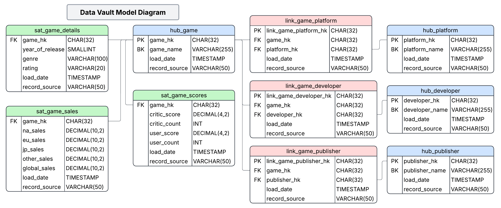
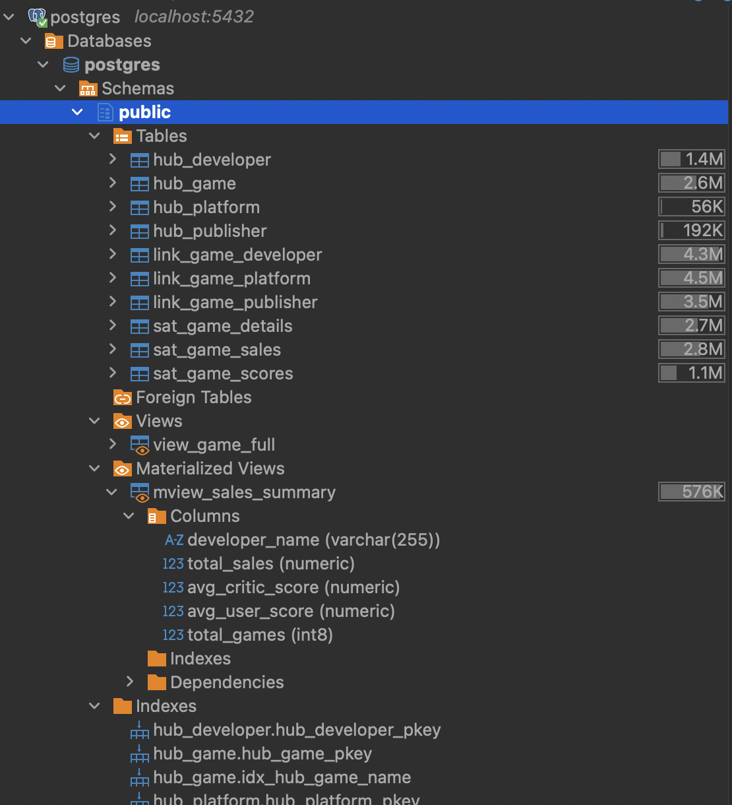

# 🎮 Video Game Sales — Data Vault Modeling Project

## 📘 Overview
This project demonstrates a **Data Vault** implementation in **PostgreSQL**, using the **Video Game Sales with Ratings** dataset from [Kaggle](https://www.kaggle.com/datasets/rush4ratio/video-game-sales-with-ratings).  
It includes full ETL processing in **Python (Pandas)**, **data modeling**, **database indexing**, **maintenance scripts**, and **analytical views** for reporting.

The main goal was to design a **scalable, auditable data warehouse structure (Data Vault)** and extend it with **analytical and materialized views** for business insights.

---

## 🧭 Project Objective
- Build a **Data Vault** model (Hubs, Links, Satellites) for the game sales dataset.  
- Automate the **ETL process** from CSV to PostgreSQL.  
- Optimize the database with indexes and maintenance routines.  
- Create **views** and **materialized views** for analytical reporting.  
- Demonstrate clean and practical data engineering principles.

---

## 🛠️ Tools & Technologies
| Category | Tools / Libraries |
|-----------|------------------|
| **Language** | Python 3, SQL |
| **Data Processing** | Pandas, NumPy |
| **Database** | PostgreSQL |
| **ETL Connection** | psycopg2 |
| **Modeling** | Lucidchart (ERD Diagram) |
| **Visualization** | SQL-based summaries and aggregates |
| **Versioning** | Jupyter Notebook + SQL Scripts |

---

## 🧩 Project Structure

- [**data**](data/) – raw source CSV files  
  - [`video_games_sales_with_ratings.csv`](data/video_games_sales_with_ratings.csv) - data CSV file  
  - [`README.md`](data/README.md) - dataset details
- [**notebooks**](notebooks/) – Jupyter notebooks for data processing and loading  
  - [`01_data_vault_load.ipynb`](notebooks/01_data_vault_load.ipynb)  

- [**sql**](sql/) – SQL scripts for creating tables, indexes, maintenance, and views  
  - [`01_data_vault_tables.sql`](sql/01_data_vault_tables.sql) – create hubs, links, satellites  
  - [`02_indexes.sql`](sql/02_indexes.sql) – create indexes on largest tables  
  - [`03_maintenance.sql`](sql/03_maintenance.sql) – vacuum, analyze, reindex  
  - [`04_views_and_mviews.sql`](sql/04_views_and_mviews.sql) – analytical and materialized views  

- **screenshots**

- **README.md** – project documentation

---

## 🧠 Data Vault Model

The model follows the **Data Vault** standard:

- **Hubs:**  
  - `hub_game`  
  - `hub_platform`  
  - `hub_developer`  
  - `hub_publisher`

- **Links:**  
  - `link_game_platform`  
  - `link_game_developer`  
  - `link_game_publisher`

- **Satellites:**  
  - `sat_game_details`  
  - `sat_game_sales`  
  - `sat_game_scores`

Each entity is loaded from the CSV dataset via Python, using **hashed business keys (MD5)** and **metadata fields** (`load_date`, `record_source`).

---

## 🗺️ Data Vault Model Diagram

---

## ⚙️ ETL Process
### [`01_data_vault_load.ipynb`](notebooks/01_data_vault_load.ipynb)  

The notebook performs the following steps:
1. **Load CSV** data using Pandas.  
2. **Clean and standardize** column names and missing values.  
3. **Split multi-value columns** (developers/publishers) into separate rows.  
4. **Generate hash keys (HK)** for all Hubs and Links.  
5. **Prepare Hub, Link, and Satellite DataFrames.**  
6. **Insert data into PostgreSQL** using psycopg2.  

This ensures **traceability**, **consistency**, and **no duplicate business keys**.

---

## 🧱 SQL Scripts

### [`01_data_vault_tables.sql`](sql/01_data_vault_tables.sql)
Defines the **Data Vault schema**:
- Hubs, Links, and Satellites with **referential integrity**.
- Each table includes `load_date` and `record_source`.

### [`02_indexes.sql`](sql/02_indexes.sql)
Creates **indexes** only on the **largest tables** (based on size analysis).  
This improves join and lookup performance without over-indexing.

### [`03_maintenance.sql`](sql/03_maintenance.sql)
Routine **database maintenance**:
- Cleans up and updates statistics.  
- Simple **index bloat check** to monitor performance.  
- Optional **VACUUM FULL** and **REINDEX** operations for large tables.

### [`04_views_and_mviews.sql`](sql/04_views_and_mviews.sql)
Adds the **analytical layer**:
- `view_game_full`: a **denormalized analytical view** joining all vault entities.  
- `mview_sales_summary`: a **materialized view** that pre-aggregates sales and scores per developer for faster reporting.  
- Command to refresh materialized view

---

## ✅ Summary

This project demonstrates:
- An **end-to-end data pipeline** from raw CSV → PostgreSQL Data Vault → analytical reporting layer.  
- Use of **hash-based business keys**, **referential integrity**, and **load metadata** for auditability.  
- Practical **indexing and optimization** strategies to balance performance and storage.  
- A foundation for **scalable, maintainable analytical models** using materialized views.

#### Database view in DBeaver

---